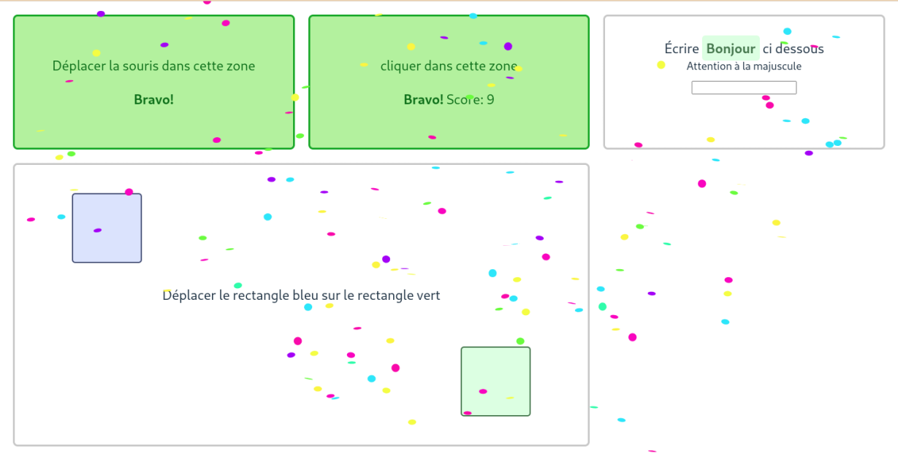

# Computer exercises
A set of exercises to help students learn the basics of computer interactions (mouse, click, drag, keyboard, etc...)




## Url parameter
### cards
by default, all cards are enabled, but the `cards` url parameter lets you select a list of "modules" to enable  
**Example**: [?cards=mouse-over,mouse-click,drag-basic](https://projects.bastiengirschig.com/exercices/?cards=mouse-over,mouse-click,drag-basic)

### no-confetti
use this to disable the confetti effect on success (for low-end devices or students who don't like it)  
**Example**: [?no-confetti](https://projects.bastiengirschig.com/exercices/?no-confetti)


## workflow
``` bash
# install
git clone git@github.com:bgirschig/learning-toys.git
cd learning-toys/
npm install

# run locally
npm run dev

# deploy
./deploy.sh
```